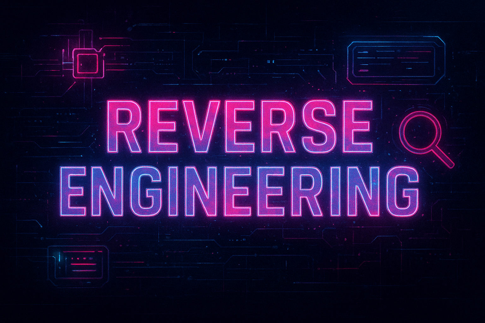

# Reverse Engineering Challenges

If you're new, checkout this really comprehensive [book](https://repository.root-me.org/Reverse%20Engineering/EN%20-%20Reverse%20Engineering%20for%20Beginners%20-%20Dennis%20Yurichev.pdf) on reversing. There are also a couple great courses at [OST2](https://p.ost2.fyi/courses) 

- **Q1. Easy — Windows Binary**  
  [Download Task0.exe](./Task0.exe)
  A Windows executable that hides a flag using a simple transformation.
  Basic reversing skills will uncover the correct input.

- **Q2. Medium — Windows Binary**  
  [Download Task1.exe](./Task1.exe)
  The program takes a username, applies a custom hash routine, and outputs a hexadecimal value. 
  Your task is to figure out the correct transformation.  

- **Q3. Hard — ELF Binary**  
  [Download Task2](./Task2)
  A classic constraint-based crackme. 
  Solving it requires analyzing the conditions and developing your own external solver script to generate the valid input.

---

*Bonus for Task2 : You may also attempt basic binary exploitation and include screenshots of your process in the write-up.*

You can also solve this year's first [FLARE On](https://flare-on.com/) challenge, we'll definitely be impressed :)

