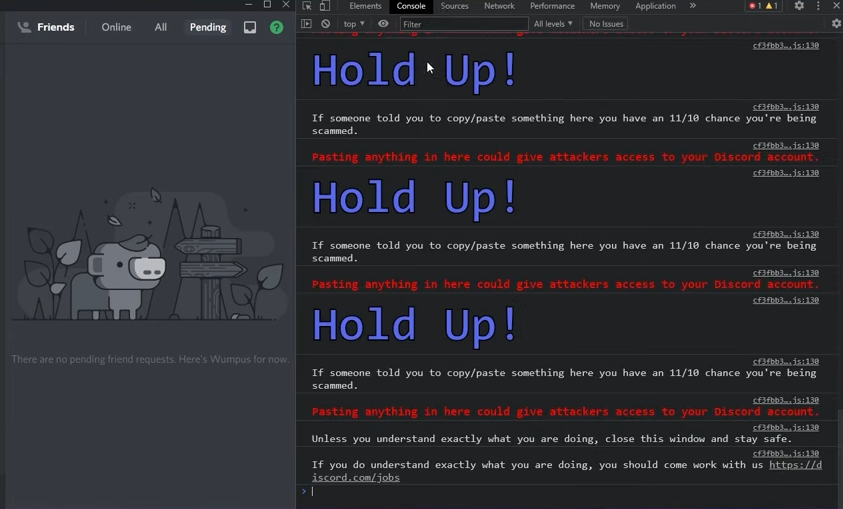

# Web exploitation tasks

Web exploitation is a varied field, but somewhat of an [armchair](https://www.youtube.com/shorts/FbeaklEkMgM) process as well.

## How to get started

We hope you're familiar with XSS, SQLi, and file upload exploits. These form the bread and butter of web exp.

1. Task 0 - Try [this](https://github.com/ImaginaryCTF/ImaginaryCTF-2024-Challenges/tree/main/Web/readme)
2. Task 1 - https://portswigger.net/web-security/cross-site-scripting/reflected/lab-html-context-nothing-encoded
3. Task 2 - https://portswigger.net/web-security/sql-injection/union-attacks/lab-retrieve-data-from-other-tables
4. (BONUS) Task 3 -  https://luc1f3r0001.github.io/xsssite/  HINT - Pop a javascript alert box, only an 'alert' box and not anyother popup window for eg 'prompt'. Exploit the functionality of the app to find a bug which could lead to xss.

