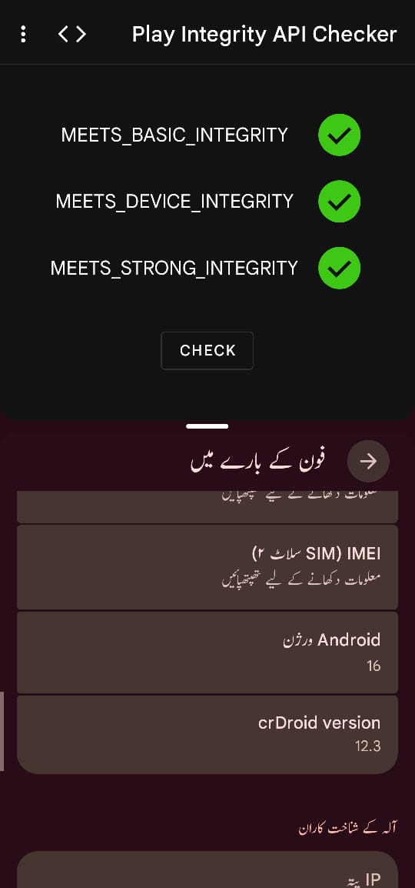

# Mobile Security

Since the dawn of smart phones, manufacturers (OEMs) and power users have been in a cat-and-mouse chase to root phones and patch fixes. It wasn't that bad, but since the start of this decade, things have been getting worse. The creator of Magisk [joined Google](https://topjohnwu.medium.com/state-of-magisk-2021-fe29fdaee458), Google deprecated [SafetyNet](https://developers.google.com/android/reference/com/google/android/gms/safetynet/SafetyNet) and replaced it with [PlayIntegrity](https://developer.android.com/google/play/integrity). Things took a turn for the worse when in May this year, Google started [enforcing locked bootloader checks, even for DEVICE integrity](https://xdaforums.com/t/pif-ts-faq.4653307/).

This comes with its own set of flaws that can [potentially be bypassed]( https://tryigit.dev/android-keybox-attestation-analysis/), but relies on hacks and tricks that may not always work.

Something I recently noticed was that while I could  with GApps ([APatch](https://github.com/bmax121/APatch/)+[ReZygisk](https://github.com/PerformanC/ReZygisk)+[PIF](https://github.com/osm0sis/PlayIntegrityFork/)+[TEESimulator](https://github.com/JingMatrix/TEESimulator)), achieving the same with [microg](https://github.com/microg/GmsCore/wiki) was not possible (same list of modules). In fact, I couldn't even meet device integrity. 

Come up with a way to pass atleast device integrity with microg installed, ideally with a new plugin. [without a paid keybox ;) ]

## Evaluation Criteria
1. Understanding of basic concepts [20%] - Integrity, TEE, Verified boot, etc
2. Investigating failure [50%] - Why PI checks fail, root cause
3. Meeting device integrity [15%]
3. Meeting strong integrity [15%]

## Deliverables

A plugin/script that can be run and fixes the identified issue. A detailed document that identifies the root cause, with supporting evidence such as logs, and network traffic.
